# Cursor 账号管家 · 用户指南

多账号一键切换、实时额度、踢设备、导入导出。浏览器授权可自动续期，全部 token 只存在本机。

Grok Bot 加速是可选附加功能，不注入也能正常切号、看额度。

加群交流：

- **QQ 一群**：`872329220`（满员请加二群）
- **QQ 二群**：`1087128280`

> 账号管理不限 Cursor 版本。Grok 注入目前仅兼容 **3.18.9 / 3.18.25 / 3.19.13**。文中截图为占位图，后续替换为实拍即可。

---

## 目录

1. [安装](#1-安装)
2. [打开侧栏](#2-打开侧栏)
3. [界面总览](#3-界面总览)
4. [添加账号](#4-添加账号)
5. [查看额度](#5-查看额度)
6. [切换账号](#6-切换账号)
7. [单个账号操作](#7-单个账号操作)
8. [批量操作](#8-批量操作)
9. [导入 / 导出备份](#9-导入--导出备份)
10. [附加功能：Grok Bot 加速](#10-附加功能grok-bot-加速)
11. [关于与交流群](#11-关于与交流群)
12. [常见问题](#12-常见问题)
13. [安全说明](#13-安全说明)

---

## 1. 安装

### 1.1 下载安装包

到 [Releases](https://github.com/Roshin0320/cursor-account-manager-vsix/releases) 下载最新的 `.vsix`，例如：

`cursor-account-manager-1.0.0.vsix`

覆盖安装不会清空已保存的账号。

### 1.2 在 Cursor 里安装

1. 打开 Cursor
2. `Cmd + Shift + P`（Windows / Linux 用 `Ctrl + Shift + P`）打开命令面板
3. 输入并选择 **`Extensions: Install from VSIX...`**
4. 选中刚下载的 `.vsix`
5. 安装完成后如提示 Reload，点 Reload


### 1.3 确认装好了

左侧活动栏会出现 **账号管家** 图标。点它打开侧栏。也可以命令面板搜 **「打开账号管家」**。

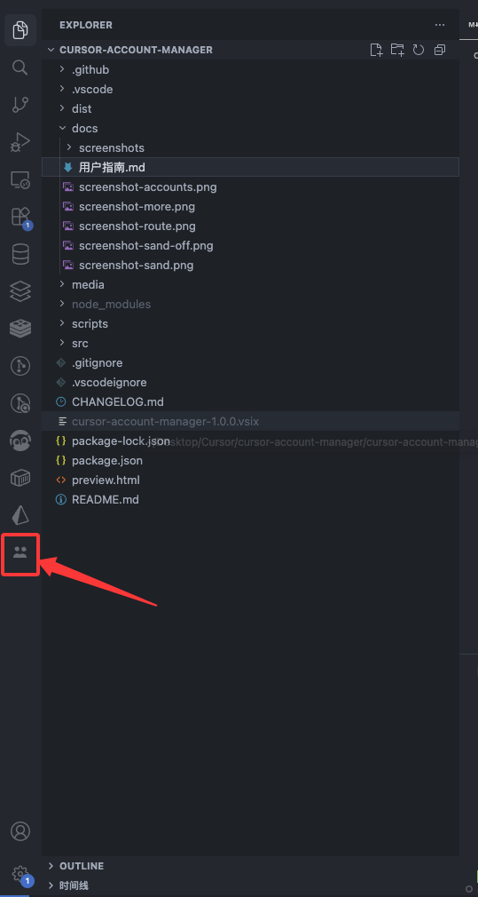

---

## 2. 打开侧栏

插件是侧栏 Webview，不是单独窗口。

| 方式 | 操作                      |
| ---- | ------------------------- |
| 图标 | 点活动栏里的账号管家图标  |
| 命令 | 命令面板 → `打开账号管家` |

第一次打开如果还没有账号，会看到空状态，并提示用浏览器授权添加。


---

## 3. 界面总览

顶部三个页签。日常主要用 **账号**，Grok 是可选附加页。

| 页签     | 做什么                                           |
| -------- | ------------------------------------------------ |
| **账号** | 主功能：加号、切号、看额度、踢设备、导入导出     |
| **Grok** | 附加：注入 / 卸载加速，看各号 Bot 额度（可不用） |
| **关于** | 介绍与交流群                                     |

右上角是当前插件版本号。

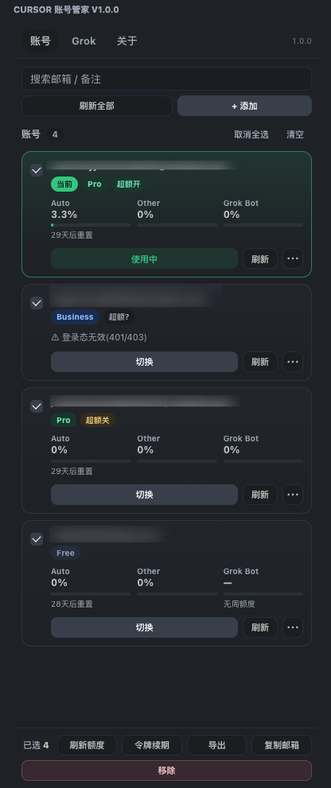

账号卡片上一般能看到：

- 邮箱（点击可复制）
- 备注
- 是否当前登录
- Auto / Other / Bot 用量和重置时间
- 超额开关（免费套餐不显示）
- **切换**、**刷新** / **升级**、**⋯** 更多

---

## 4. 添加账号

在「账号」页点右上角 **+ 添加**。

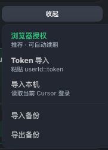

三种加号方式，优先用第一种。

### 4.1 浏览器授权（推荐）

1. 点 **浏览器授权**
2. 会弹出隔离浏览器，打开 Cursor 登录页
3. 用要加入的账号完成登录
4. 登录成功后，插件自动收下可续期令牌，账号出现在列表里

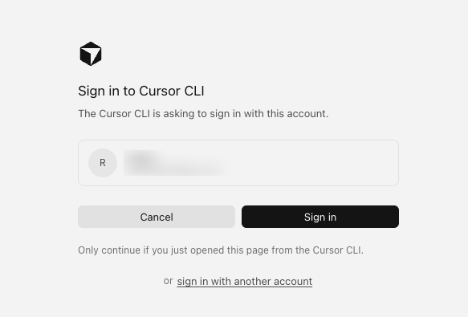

优点：带 refreshToken，后台可自动续期，不容易掉登录。

### 4.2 Token 导入

适合已经拿到会话串的情况。点 **Token 导入**，粘贴下面任一格式：

```text
userId::accessToken
userId::accessToken::refreshToken
WorkosCursorSessionToken=...
```

带第三段 `refreshToken` 的才能自动续期。只有前两段的属于 Web 令牌，列表里会提示 **升级**。

### 4.3 导入本机

点 **导入本机**，读取当前这台 Cursor 已经登录的账号，加入列表。

这是「把现在正在用的号收进来」，不是新登录。若当前登录本身不能续期，收进来之后仍建议对该号点 **升级**。

---

## 5. 查看额度

列表里每个账号会显示：

| 列           | 含义                                     |
| ------------ | ---------------------------------------- |
| **Auto**     | Auto 用量                                |
| **Other**    | 其他模型用量                             |
| **Grok Bot** | Bot 周额度；没有周额度会显示「无周额度」 |

重置时间在用量下方。点 **刷新** 或顶部 **刷新全部** 会联网向 Cursor 官方接口拉最新数据。

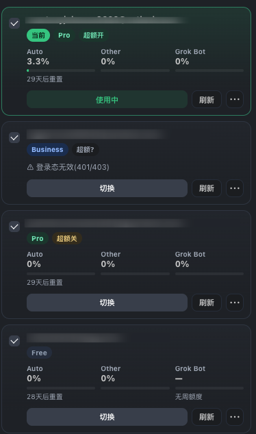

付费套餐可以点 **超额开 / 超额关**：

- **开启无限超额**：套餐用完后继续按用量计费，可能产生额外费用
- **关闭超额**：额度用完就不能再超量

免费套餐没有这项。改之前会弹出确认框。

顶部搜索框可按 **邮箱 / 备注** 过滤。

---

## 6. 切换账号

1. 在目标账号上点 **切换**（当前号不会再显示这个按钮）
2. 确认后，插件会备份并替换 Cursor 全局登录态
3. 弹出重启提示时，点 **立即重启**


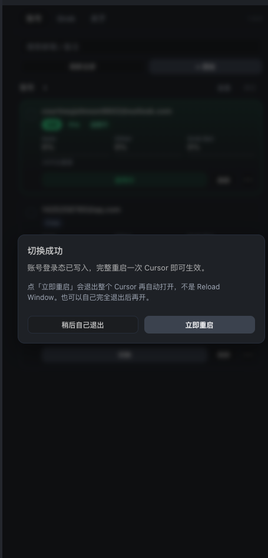

**必须完整退出 Cursor 再打开。** 只 Reload Window 不够，托盘里的 Cursor 也要退干净。

点「立即重启」会结束进程并自动再打开，不要中途点 Reload。也可以选「稍后自己退出」，自己完全退出后再开。

---

## 7. 单个账号操作

点卡片右侧 **⋯** 打开更多菜单。

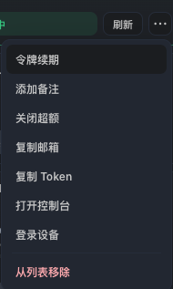

| 操作                | 说明                                   |
| ------------------- | -------------------------------------- |
| **切换账号**        | 切到该号，然后完整重启                 |
| **令牌续期**        | 浏览器授权号：换新 accessToken         |
| **升级为可续期**    | Web 令牌：再走一遍隔离浏览器登录       |
| **添加 / 修改备注** | 最多 24 字，显示在邮箱旁；留空即清除   |
| **开启 / 关闭超额** | 付费号；开启后可能产生额外费用         |
| **复制邮箱**        | 复制到剪贴板                           |
| **复制 Token**      | 明文 token，不要发给别人、不要传到网上 |
| **打开控制台**      | 打开该号的 Cursor 网页控制台           |
| **登录设备**        | 查看已登录设备，可踢下线               |
| **从列表移除**      | 只删插件记录，不会退出 Cursor 当前登录 |

### 7.1 踢设备

1. ⋯ → **登录设备**
2. 对应网页控制台 Settings → Active Sessions
3. 点某台设备的 **踢下线**，再确认

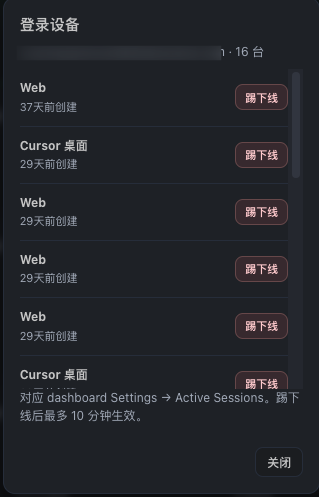

踢下线最多约 10 分钟生效。如果只剩一台，它可能就是当前网页会话，踢掉后额度接口会失效，需要重新导入或再授权。

---

## 8. 批量操作

勾选账号后，底部出现批量栏。可用 **全选 / 清空**。


| 按钮         | 作用                                 |
| ------------ | ------------------------------------ |
| **刷新额度** | 只刷新勾选的号                       |
| **令牌续期** | 只续期可续期的号；纯 Web 令牌会跳过  |
| **导出**     | 只导出勾选的号                       |
| **复制邮箱** | 批量复制邮箱                         |
| **移除**     | 只从列表删除，不影响 Cursor 当前登录 |

---

## 9. 导入 / 导出备份

在 **+ 添加** 菜单底部：

- **导出备份**：导出全部账号为 JSON，先预览再选保存位置
- **导入备份**：选 JSON，预览「新增 / 更新」数量，确认后才写入

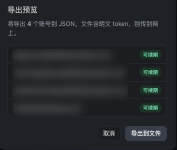

导入**不会先清空**现有列表：已有邮箱会更新，没有的会新增。

备份文件含明文 token，请只放本机，不要发到网盘、群文件或聊天里。

---

## 10. 附加功能：Grok Bot 加速

这是可选附加功能，和账号管理互不影响。不注入也能切号、看额度、踢设备。需要加速时再切到 **Grok** 页。

上半是注入状态，下半是各账号 Bot 额度。

### 10.1 注入

1. 确认 Cursor 版本是 **3.18.9 / 3.18.25 / 3.19.13**
2. 点 **注入**，看清提示后点 **一键注入**
3. 注入前会自动备份原始文件
4. **完全退出 Cursor（含托盘）再打开**

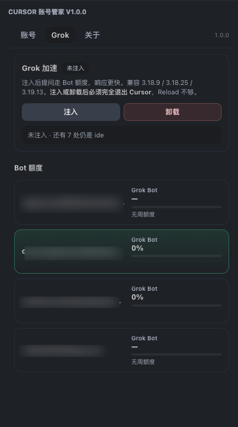

注入后的效果：

- 提问走 Bot 额度，不消耗订阅额度
- 少等 Planning，回复更快
- 子代理 / Task / resume 仍可用

状态角标：**未注入** / **部分注入** / **已注入** / **异常**。版本不对或锚点对不上时会拒绝写入，不会硬改。

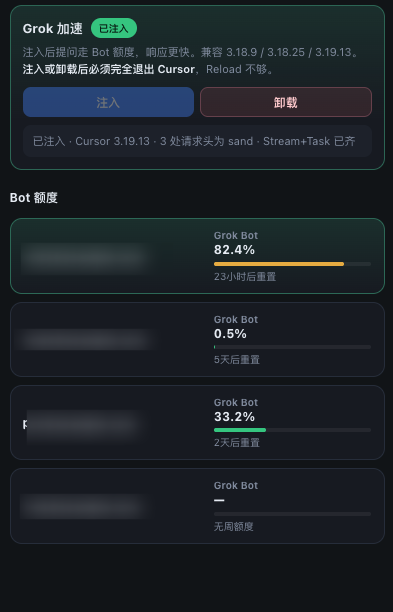

注入成功后，对话里的路由提示会变成类似「本次使用」，表示走了 Bot。


### 10.2 卸载

点 **卸载** → 确认。会还原注入时备份的原始文件，也能拆掉更早版本打过的补丁。

卸载后同样必须**完整退出再打开**。只 Reload 不生效。

---

## 11. 关于与交流群

侧栏 **关于** 页可以看插件介绍，扫码加群。

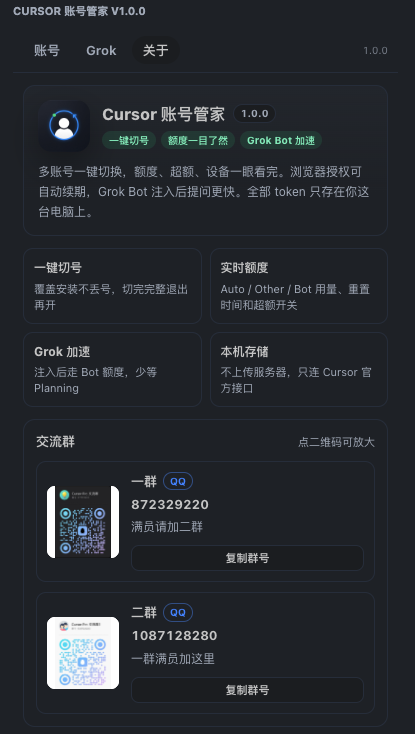

### 11.1 QQ 交流群

| 群       | 群号         | 说明           |
| -------- | ------------ | -------------- |
| **一群** | `872329220`  | 满员请加二群   |
| **二群** | `1087128280` | 一群满员加这里 |

扫码进群：

<table>
  <tr>
    <td align="center">一群<br></td>
    <td align="center">二群<br></td>
  </tr>
</table>

插件里点二维码可放大，QQ 群可点 **复制群号**。

---

## 12. 常见问题

### 账号管理

**切号后还是旧账号？**  
没有完整退出。托盘里的 Cursor 也要退干净，或用弹窗里的「立即重启」。

**额度一直转圈或刷新失败？**  
检查网络，确认能访问 Cursor 官方接口。Web 令牌过期就对该号点 **升级**，或重新浏览器授权。

**浏览器授权弹不出窗口？**  
本机要能打开系统浏览器。杀毒或公司策略拦截时，改用 Token 导入。

**覆盖安装后账号没了？**  
正常不会。若手动清过 Cursor 用户数据，列表会空，用之前的 JSON 备份导入即可。

**踢设备后额度读不了？**  
可能把当前网页会话踢掉了。重新浏览器授权，或再导入该号。

**还有别的问题？**  
加 QQ 群交流：一群 `872329220`，满员加二群 `1087128280`。也可以到 [Issues](https://github.com/Roshin0320/cursor-account-manager-vsix/issues) 反馈。

### Grok 加速（可选）

**注入了但提问还是很慢 / 仍走订阅额度？**  
同样需要完整重启。再看 Grok 页是不是「已注入」。只 Reload、或 Cursor 版本不在兼容列表里，都不会生效。

**提示版本不兼容，不让注入？**  
当前只支持 3.18.9 / 3.18.25 / 3.19.13。换到这些版本，或等插件更新。不影响账号管理本身。

---

## 13. 安全说明

- Token 只写本机，不上传到第三方服务器
- 联网只访问 Cursor 官方：`cursor.com`、`api2.cursor.sh`
- 没有统计分析、没有隐藏上报
- 导出 JSON、复制 Token 都是明文，当作密码保管
- 开启超额会按官方规则计费，费用以 Cursor 账单为准

---

## 附录：建议操作顺序

第一次用按这个走即可，前 5 步就是主流程：

1. 安装 `.vsix`，打开侧栏
2. **浏览器授权** 加号（需要几个加几个）
3. 看清额度，给号加备注
4. 切到要用的号，**立即重启**
5. 定期 **导出备份**，文件只放本机
6. （可选）需要加速时，再到 Grok 页 **注入**，并完整重启一次
